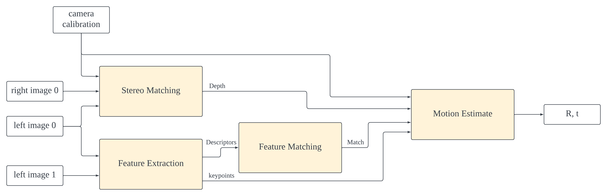

# **High-Level Synthesis on Visual Odometry**
This repository is for the project in the course 
**Special Project on Electrical Engineering**. 

It contains the code for our High-Level Synthesis (HLS) project on Visual Odometry. The Visual Odometry datasets are based on *KITTI*. The project was implemented using the *Xilinx Vitis™* HLS design flow and tested on the *Alveo U50 Data Center Accelerator Cards*. 

Our goal is to accomplish an end-to-end service of accelerated visual odometry. It's our first time to learn High-Level Synthesis in Vitis design flow.

The detailed documents can be found in [robotics-computing](https://github.com/bol-edu/robotics-computing.git).

## **Table of Content**
- [Team Members](#team-members)
- [Instructors](#instructors)
- [Design Flow](#design-flow)
- [Algorithms](#algorithms)

## **Team Members**
- [郭朝恩](https://github.com/ShinjuGoenji)
- [黃鈺銘](https://github.com/Hotcorngg) *from* ***National Yang Ming Chiao Tung University***
- [鄧文瑜](https://github.com/kevinteng9023)
- [林妤諠](https://github.com/Yuhsuanlinn)
- 林奕杰
- 李承澔 *from* ***National Tsing Hua University***

## **Instructors**
- 賴謹 *prof*
- 翁華揚 *TA*

## **Design Flow**
- ## Get Started
    We start our project by studying [**KITTI Odometry in Python and OpenCV - Beginner's Guide to Computer Vision**](https://github.com/FoamoftheSea/KITTI_visual_odometry.git) (shout out to [FoamoftheSea](https://github.com/FoamoftheSea) by the way). It helps us understand what's happening in the whole system.
    
    We then turn the [python code](./src/tutorial%20python%20code/KITTI_visual_odometry.ipynb) into [C/C++ code](./src/tutorial%20C%20code), while the algorithms are still implemented by calling OpenCV API functions. The overall structure appears as well during our weekly discussions.
    
    

## **Algorithms**
- ## Stereo Matching
- ## Feature Extraction
- ## Feature Matching
- ## Motion Estimate
    Estimating the relative motion between camera poses using depth map and matched keypoints. This algorithm is using **RANSAC-EPnP** (RANdom SAmple Consensus, Efficient Perspective-n-Point) and **Iterative PnP** (Direct Linear Transform).

    The [pure c/c++ code]() is extracted from **OpenCV** source code, and modified to synthesizable [HLS code]() due to HLS requirements.